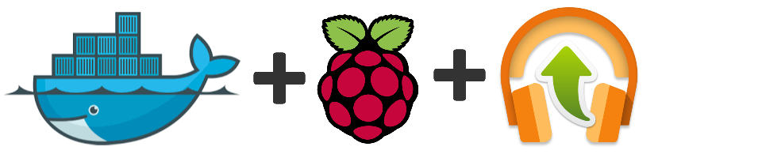

Raspberry PI - Google Music Uploader - Docker Image
===================================================

[](http://github.com/jaymoulin/docker-rpi-google-music-uploader/releases)
[](https://hub.docker.com/r/jaymoulin/rpi-google-music-uploader/)
[](https://hub.docker.com/r/jaymoulin/rpi-google-music-uploader/)
[](https://m.freewallet.org/id/374ad82e/btc)
[](https://m.freewallet.org/id/374ad82e/ltc)
[](https://www.paypal.me/jaymoulin)
[](https://beerpay.io/jaymoulin/docker-rpi-google-music-uploader)

This image allows you to watch a folder and upload all new MP3 added to your Google Music Library.
This image is based on [Google MusicManager](https://github.com/jaymoulin/google-music-manager)

Installation
---

```
docker run -d --restart=always -v /path/to/your/library:/media/library --name googlemusic jaymoulin/rpi-google-music-uploader
```

You must define your path to your library in a volume to `/media/library`
You can also mount another volume to `/root/oauth` folder to retrieve your oauth key 

Configuration
---
First, you have to allow the container to access your Google Music account
```
docker exec -ti googlemusic auth
```
Then follow prompted instructions.

You will be asked to go to a Google URL to allow the connection:

```
Visit the following url:
 https://accounts.google.com/o/oauth2/v2/auth?client_id=XXXXXXXXXXX.apps.googleusercontent.com&access_type=offline&scope=https%3A%2F%2Fwww.googleapis.com%2Fauth%2Fmusicmanager&response_type=code&redirect_uri=urn%3Aietf%3Awg%3Aoauth%3A2.0%3Aoob
Follow the prompts, then paste the auth code here and hit enter:
```

Once done, restart the container to start watching your folder and uploading your MP3.
```
docker restart googlemusic
```

Appendixes
---

### Install RaspberryPi Docker

If you don't have Docker installed yet, you can do it easily in one line using this command
 
```
curl -sSL "https://gist.githubusercontent.com/jaymoulin/e749a189511cd965f45919f2f99e45f3/raw/0e650b38fde684c4ac534b254099d6d5543375f1/ARM%2520(Raspberry%2520PI)%2520Docker%2520Install" | sudo sh && sudo usermod -aG docker $USER
```


